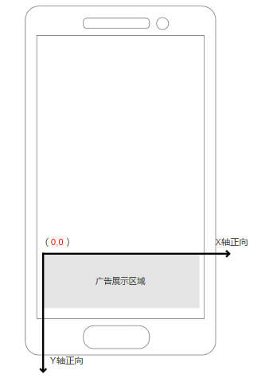

# SSP 对接文档协议

- [SSP 对接文档协议](#ssp-%E5%AF%B9%E6%8E%A5%E6%96%87%E6%A1%A3%E5%8D%8F%E8%AE%AE)
    - [文档说明](#%E6%96%87%E6%A1%A3%E8%AF%B4%E6%98%8E)
    - [接入准备](#%E6%8E%A5%E5%85%A5%E5%87%86%E5%A4%87)
    - [实时竞价流程](#%E5%AE%9E%E6%97%B6%E7%AB%9E%E4%BB%B7%E6%B5%81%E7%A8%8B)
    - [接入说明](#%E6%8E%A5%E5%85%A5%E8%AF%B4%E6%98%8E)
        - [请求 URL](#%E8%AF%B7%E6%B1%82-url)
        - [通信方式及编码](#%E9%80%9A%E4%BF%A1%E6%96%B9%E5%BC%8F%E5%8F%8A%E7%BC%96%E7%A0%81)
        - [请求头](#%E8%AF%B7%E6%B1%82%E5%A4%B4)
        - [竞价请求](#%E7%AB%9E%E4%BB%B7%E8%AF%B7%E6%B1%82)
            - [Request 字段信息](#request-%E5%AD%97%E6%AE%B5%E4%BF%A1%E6%81%AF)
                - [公共信息](#app-%E5%AF%B9%E8%B1%A1%E4%BF%A1%E6%81%AF)
                - [App 与 广告位信息](#site-%E5%AF%B9%E8%B1%A1%E4%BF%A1%E6%81%AF)
                - [Device 信息](#device-%E5%AF%B9%E8%B1%A1%E4%BF%A1%E6%81%AF)
        - [SSP 返回信息](#adx-%E8%BF%94%E5%9B%9E%E4%BF%A1%E6%81%AF)
            - [Response 字段信息](#response-%E5%AD%97%E6%AE%B5%E4%BF%A1%E6%81%AF)
                - [Ad 对象信息](#ad-%E5%AF%B9%E8%B1%A1%E4%BF%A1%E6%81%AF-1)
        - [上报地址宏替换信息](#%E4%B8%8A%E6%8A%A5%E5%9C%B0%E5%9D%80%E5%AE%8F%E6%9B%BF%E6%8D%A2%E4%BF%A1%E6%81%AF)

## 文档说明

此文档仅供开发者与AdTraderX使用 API 方式对接时使用

## 接入准备

见对接前需知

## 实时竞价流程

实时竞标(RTB) 是指在用户在访问开发者的应用，产生广告曝光机会时，SSP/应用向 AdTraderX 发送带有广告位信息的广告请求，AdTraderX
将广告请求信息进行重新组织，按照与DSP约定的规范将请求信息发送给 DSP，DSP 根据自己的广告投放逻辑向AdTraderX返回广告及竞价的价格，AdTraderX
根据某种规则完成竞拍，并且将结果返回给DSP，同时返回获胜的DSP的广告信息给 SSP/应用，由 SSP/应用展示广告。

下面描述了一个曝光从发生到实时竞标，直到最后获胜广告展示的全过程：

1） 用户(USER)发起访问请求，产生曝光机会时，SSP 将用户请求发送到 ADX

2） ADX 向众多家 DSP 并行发起曝光竞标请求，DSP 进行估值后给出此次曝光的报价，ADX 集齐 DSP 报价返回后进行竞拍

3） ADX 将竞标成功的 DSP 广告信息返回给 SSP 平台，SSP 将获胜 DSP 的广告返回给用户展示

4） 在广告展示的同时向 DSP 发送展示通知及竞价结果

其中 ADX 与 SSP 的实时交互集中在 第一步 和 第三步。

## 接入说明

### 请求 URL

当需要请求广告时，发送一个HTTP请求到下面的地址

测试环境地址：http://smartbid-test.adtrader.cn/v1/getad

**正式环境地址：http://smartbid.adtrader.cn/v1/getad**

### 通信方式及编码

App 和 AdxTraderX 之间的基础通信协议采用 HTTP 协议、POST，编码采用 UTF-8 编码。

### 请求头

| http 头信息段  | 说明                                                                                                                                                                                      |
|------------|-----------------------------------------------------------------------------------------------------------------------------------------------------------------------------------------|
| User-Agent | 移动设备的 User-Agent，从服务端使用非真实 User-Agent 会被视为问题流量。 例：“Mozilla/5.0 (iPad; CPU OS 5_0 like Mac OS X)， AppleWebKit/534.46 (KHTML， like Gecko)， Version/5.1 Mobile/9A334 Safari/7534.48.3”。 |

### 竞价请求

Request 请求是广告位请求广告的入口，由 App 按本文档中规定 URL 向 AdTraderX 发送。

#### Request 字段信息

| 字段名称   | 类型     | 必须  | 描述                   |
|--------|--------|-----|----------------------|
| id     | string | 是   | 请求ID                 |
| secure | int    | 否   | 是否需要https链接的标识，默认为 0 |
| app    | 对象     | 是   | app 对象信息             |
| device | 对象     | 是   | 设备信息                 |
| imp    | imp    | 是   | 广告位对象信息              |

##### Imp 广告位对象信息

| 字段名称      | 类型  | 必须  | 描述                    |
|-----------|-----|-----|-----------------------|
| adslot_id | int | 是   | 广告位ID,商务同学注册          |
| ad_type   | int | 否   | 广告资源类型，1：图片，2：图文，3：视频 |
| price     | int | 否   | 广告价格:分                |

##### App 对象信息

| 字段类型   | 类型       | 必须  | 描述               |
|--------|----------|-----|------------------|
| id     | string   | 是   | app id,商务同学注册    |
| name   | string   | 是   | app 名称           |
| bundle | string   | 是   | app bundle id，包名 |
| ver    | string   | 否   | app 版本号          |
| cat    | []string | 否   | app 类别           |

##### Device 对象信息

| 字段名称            | 类型     | 必须  | 描述                                                    |
|-----------------|--------|-----|-------------------------------------------------------|
| model           | string | 是   | 设备型号                                                  |
| make            | string | 是   | 生产厂商，例如：“Samsung”                                     |
| brand           | string | 否   | 手机品牌，例如：“MI4”                                         |
| connection_type | string | 是   | 网络类型，空串表示未知，值为 wifi，2g，3g，4g,5g,ethernet，cell_unknown |
| carrier         | int    | 是   | 运营商，0：移动，1：电信，3：联通，4：unknown                          |
| orientation     | int    | 是   | 设备方向，1：纵向，3：横向                                        |
| mac             | string | 否   | MAC 地址，                                               |
| imei            | string | 否   | IMEI 码。                                               |
| imei_md5        | string | 否   | IMEI 码Md5。                                            |
| oaid            | string | 否   | 安卓广告ID                                                |
| oaid_md5        | string | 否   | 安卓广告ID                                                |
| android_id      | string | 否   | Android ID 。Android 手机不传会影响填充                         |
| idfa            | string | 是   | iOS 系统的 idfa。                                         |
| idfv            | string | 否   | idfv                                                  |
| os              | string | 是   | 操作系统类型，值为"iOS"， "Android"                             |
| osv             | string | 是   | 操作系统版本                                                |
| ip              | string | 是   | IP地址                                                  |
| ua              | string | 是   | User-agent                                            |
| width           | int    | 是   | 水平分辨率，单位：像素                                           |
| height          | int    | 是   | 纵向分辨率，单位：像素                                           |
| geo_lat         | float  | 否   | GPS 纬度（-90-90）                                        |
| geo_lon         | float  | 否   | GPS 经度（-180-180）                                      |
| boot_mark       | string | 否   |                                                       |
| update_mark     | string | 否   |                                                       |

### ADX 返回信息

#### Response 字段信息

| 字段名称 | 类型      | 必须  | 描述                          |
|------|---------|-----|-----------------------------|
| code | int     | 是   | 返回结果，0：成功，小于 0 表示失败         |
| id   | string  | 是   | 请求id                        |
| ads  | ad 对象数组 | 否   | 如果失败，或者无对应广告则无此数据 目前只返回一个广告 |

##### Ad 对象信息

| 字段名称                         | 类型     | 必须  | 描述                                          |
|------------------------------|--------|-----|---------------------------------------------|
| adslot_id                    | string | 是   | 广告位 id，与 request 中的 adslot.id 对应            |
| action                       | int    | 是   | 广告动作类型，1：在 app 内 WebView 打开目标链接，2：应用唤醒，3.下载 |                                                   |
| landing_page                 | string | 否   | 落地页目标地址                                     |
| deeplink_url                 | string | 否   | 应用唤醒deeplink地址                                 |
| fallback_url                 | string | 否   | 应用唤醒失败后的打开地址                                |
| imp_trackers                 | array  | 否   | 当广告被展示时被上报的监控 URL 列表                        |
| click_trackers               | array  | 否   | 当点击广告时被上报的监控 URL 列表                         |
| deeplink_trackers            | array  | 否   | 三方Deeplink行为上报                              |
| app_info                     | Object | 否   | 广告应用信息                                      |
| app_download_trackers        | array  | 否   | 当安卓下载类广告点击应用下载时上报的监控 URL 列表，应在后台访问          |
| app_download_finish_trackers | array  | 否   | 当安卓下载类广告应用下载完成时上报的监控 URL 列表，应在后台访问          |
| app_activate_trackers        | array  | 否   | 当安卓应用激活时上报的监控 URL 列表，应在后台访问                 |
| ad_type                      | int    | 是   | 广告资源类型，1：图片，2：图文，3：视频                       |
| w                            | int    | 是   | 广告宽度                                        |
| h                            | int    | 是   | 广告高度                                        |
| image_url                    | string | 否   | 图片地址                                        |
| title                        | string | 否   | 广告标题，图文广告时需要                                |
| desc                         | string | 否   | 广告描述，图文广告时需要                                |
| video_url                    | string | 否   | 视频类广告，视频地址                                  |
| cover_url                    | string | 否   | 视频类广告，封面地址                                  |
| price                        | int    | 否   | 广告价格, 单位分                                   |
| logo_url                     | string | 否   | 角标资源地址                                      |

##### App 对象信息

| 字段名称        | 类型     | 必须  | 描述                                                     |
|-------------|--------|-----|--------------------------------------------------------|
| app_bundle  | string | 否   | 对于 Android，是应用的 packageName；对于 iOS，是 Bundle identifier |
| app_ver     | string | 否   | 应用版本号                                                  |
| app_name    | string | 否   | 应用名称                                                   |
| developer   | string | 否   | 开发者                                                    |
| privacy_url | string | 否   | 隐私政策                                                   |
| detail_url  | string | 否   | 应用详情                                                   |

### 上报地址宏替换信息

> 客户端在触发上报信息时，必须将点击追踪链接、点击跳转地址、点击关闭、播放开始、播放完成，展示中的宏变量替换上报（如有），单位为像素。需要替换的宏坐标如下：

| 宏变量          | 类型    | 说明                       |
|--------------|-------|--------------------------|
| `__DOWN_X__` | int32 | 点击追踪链接、点击跳转地址中的点击落下 X 坐标 |
| `__DOWN_Y__` | int32 | 点击追踪链接、点击跳转地址中的点击落下 Y 坐标 |
| `__UP_X__`   | int32 | 点击追踪链接、点击跳转地址中的点击离开 X 坐标 |
| `__UP_Y__`   | int32 | 点击追踪链接、点击跳转地址中的点击离开 Y 坐标 |                       

> 广告展示内容方向与屏幕方向一致时，广告位左上角为坐标（0，0）点，见下方示例。如果无法获取上述字段，需要将值替换为-999。

